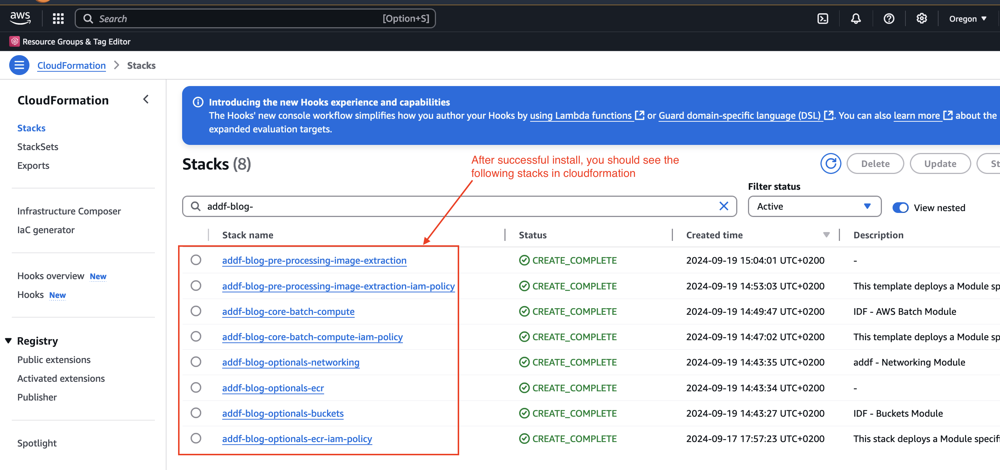
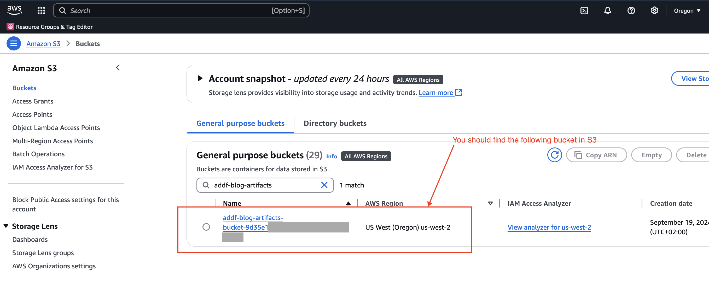
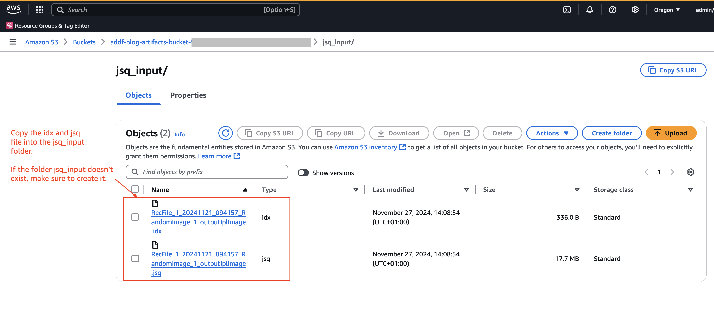
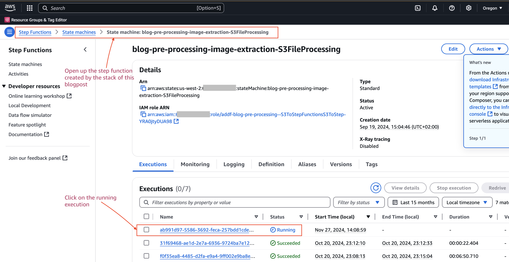
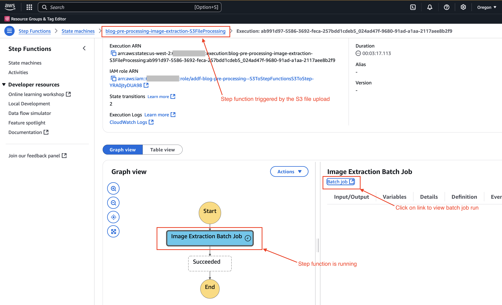
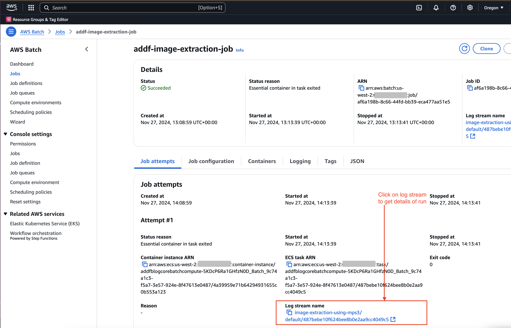
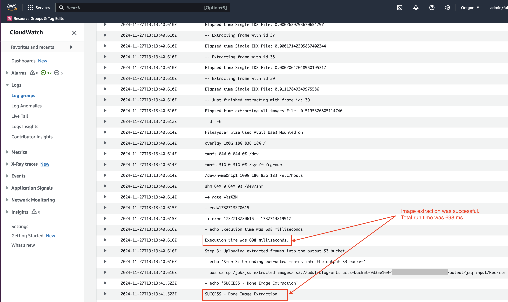
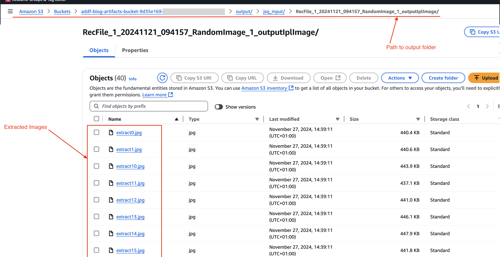
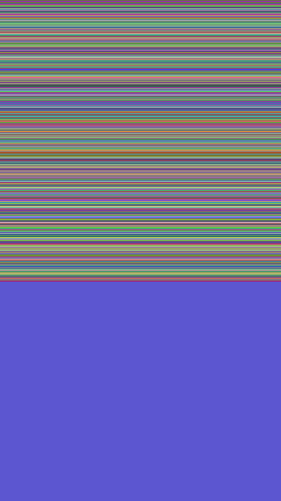

# README

This README.md will provide a step-by-step giude on how to deploy the image extraction demo using Mountpoint for Amazon S3. We suggest that you follow the guide from start to finish.

This repository was created as part of this AWS blog post: https://aws.amazon.com/blogs/industries

## Clone the project

You will need to clone the repository using the below command:

```bash
git clone image-extraction-using-mountpoint-s3
```

You should move into the repository:

```bash
cd image-extraction-using-mountpoint-s3
```

### Setup your local development environment

#### Create and activate a Virtual environment

```bash
python3 -m venv .venv
source .venv/bin/activate
```

#### Install the requirements

```bash
pip install -r ./requirements.txt
```

#### Setting the AWS Region

ADDF submits build information to AWS CodeBuild via AWS CodeSeeder.  The initial submittal is done via AWS CLI, leveraging the configured active AWS profile.  If you would like to deploy ADDF to a region other than the region configured for the profile, you can explicitly set the region via:

```bash
export AWS_DEFAULT_REGION=us-west-2
export AWS_REGION=us-west-2
```

> Note: You can set the above region to your region of interest

Please see [HERE for details](https://docs.aws.amazon.com/cli/latest/userguide/cli-configure-envvars.html)

#### Bootstrap the account for CDKV2 usage

We use AWS CDK V2 as the standard CDK version because CDK V1 is set to maintenance mode beginning June 1, 2022. You  would need to bootstrap the CDK environment (one time per region) with V2 - see [HERE](https://docs.aws.amazon.com/cdk/v2/guide/bootstrapping.html) in the account(s) you will be deploying.

```bash
cdk bootstrap aws://<<ACCOUNT_ID>>/$AWS_DEFAULT_REGION
```

> Note: Replace the `ACCOUNT_ID` in the above command with your AWS account id.

#### Bootstrap AWS Account(s) for seedfarmer deployment

Assuming that you will be using a single account, follow the guide [here](https://seed-farmer.readthedocs.io/en/latest/bootstrapping.html#) to bootstrap your account(s) to function as a toolchain and target account.

Following is the command to bootstrap your existing account to a toolchain and target account

```sh
seedfarmer bootstrap toolchain --project addf --trusted-principal [principal-arns] --as-target
```

> Note: Replace the `principal-arns` in the above command with the IAM role that you would be assuming to access AWS account. Here is an example `seedfarmer bootstrap toolchain --project addf --trusted-principal arn:aws:iam::123456789012:role/Admin --as-target`

### Deployment of image extraction solution

Now, we are ready to deploy our image extraction solutuion.

For the below walkthrough, let us use the `manifests` directory for deployment, where the deploymemt name is set to `blog` in the file `deployment.yaml` . It is the top level manifest, which should include the modules you wanted to deploy, grouped under logical containers called `group`.  Please see [manifests](https://seed-farmer.readthedocs.io/en/latest/manifests.html) for understanding more details about a deployment manifest, the keys it supports(if mandatory/optional).

#### Prepare the manifests for deployment

Please make sure to follow the below steps in the `manifests/deployment.yaml` file:

- Replace the value of `toolchainRegion` with your region of interest.
- Set the `accountId` under `targetAccountMappings` to the AWS Account you would deploy target modules. You could set the `accountId` as below:

```yaml
targetAccountMappings:
  - alias: primary
    accountId: 123456789012
```

#### Deploy the solution to your AWS account

Below is the command to deploy the modules using the `SeedFarmer` CLI using the main manifest `deployment.yaml`:

```bash
seedfarmer apply manifests/deployment.yaml --debug
```


## Run the image extraction demo step-by-step

In the following nine steps, we walk you through the prcess of triggering the image extraxction solution from start to finish. This demo will use Mountpoint for Amazon S3 to extract images.

1. Step: Verify the CloudFormation setup. You should see the following 8 stacks after successful install of the demo.


2. Step: Now, go to S3 and find the S3 bucket that starts with the name "addf-blog-artifacts-". We use this bucket to store our idx and jsq file for image extraction.
We'll also use this bucket to store our extracted imaged.


3. Step: Now, upload the idx and jsq file to the S3 bucket `addf-blog-artifacts-****/jsq_input` through the AWS console. You find the demo idx and jsq file in this folder [./sample_data](/sample_data). Once the upload process is finished, an Amazon EventBridge event will trigger the AWS Step Function `blog-pre-processing-image-extraction-S3FileProcessing`. This step function will trigger the image extraction process.


4. Step: Go to AWS Step Function and find the step function with the name `blog-pre-processing-image-extraction-S3FileProcessing`. You'll see one execution in state "running".


5. Step: Once you click on the active Step Function execution, you'll see the execution details. Click on the Batch Job Task and click on the "Batch job" link to see its details


6. Step: In AWS Batch, look at the job details by clicking on the log stream name link.


7. Step: Inspect the Cloudwatch Logs. The cloudwatch logs stream will contain all details about the image extraction job. In total, we extracted 40 images.


8. Step: Verify the output. Go back to your S3 bucket that you used for file upload. You'll find an `output/jsq_input` folder that will contain all the extracted images.


9. Step: Download one of the extracted images. The image will look like the image below. For this demo, our jsq file contained random images.


DONE. You can now decommission the solution as described in the next sub-section.

## Steps to destroy the deployment

Below is the command to destroy all the CloudFormation stacks (ADDF modules) related to this deployment:

```bash
seedfarmer destroy blog
```

> Note:
> Replace the `DEPLOYMENT_NAME` with the desired deployment name of your environment. For ex: `blog` is the current deployment name
> You can pass an optional `--debug` flag to the above command for getting debug level output


## Support & Feedback

This project is maintained by AWS Solution Architects and Consultants. It is not part of an AWS service and support is provided best-effort by the maintainers. To post feedback, submit feature ideas, or report bugs, please use the [Issues section](https://github.com/aws-samples/image-extraction-using-mountpoint-s3/issues) of this repo. If you are interested in contributing, please see the [Contribution guide](CONTRIBUTING.md).

## Security

See [CONTRIBUTING](CONTRIBUTING.md#security-issue-notifications) for more information.

## License

This library is licensed under the MIT-0 License. See the [LICENSE](LICENSE) file.